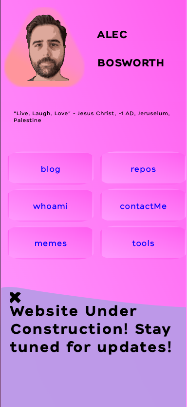
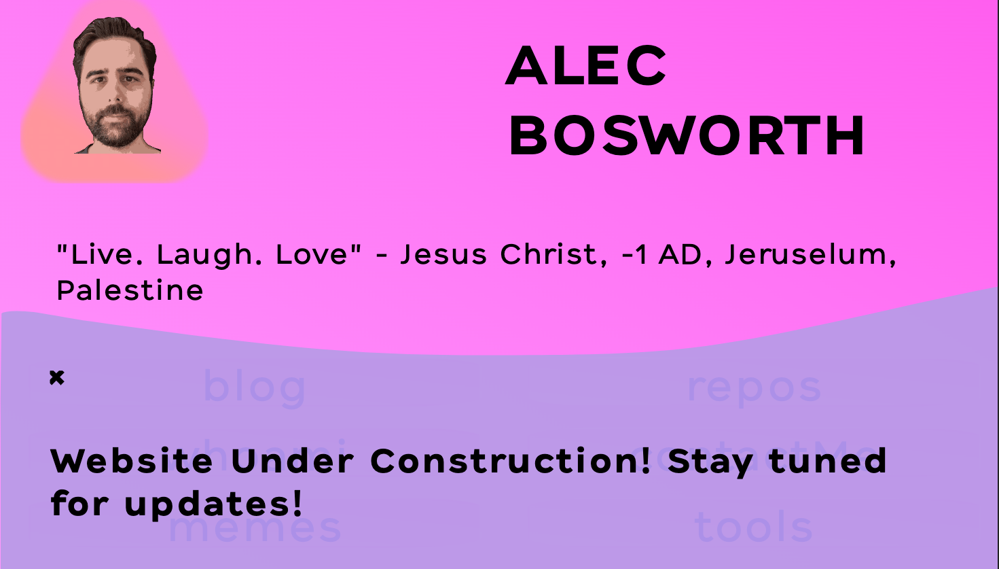
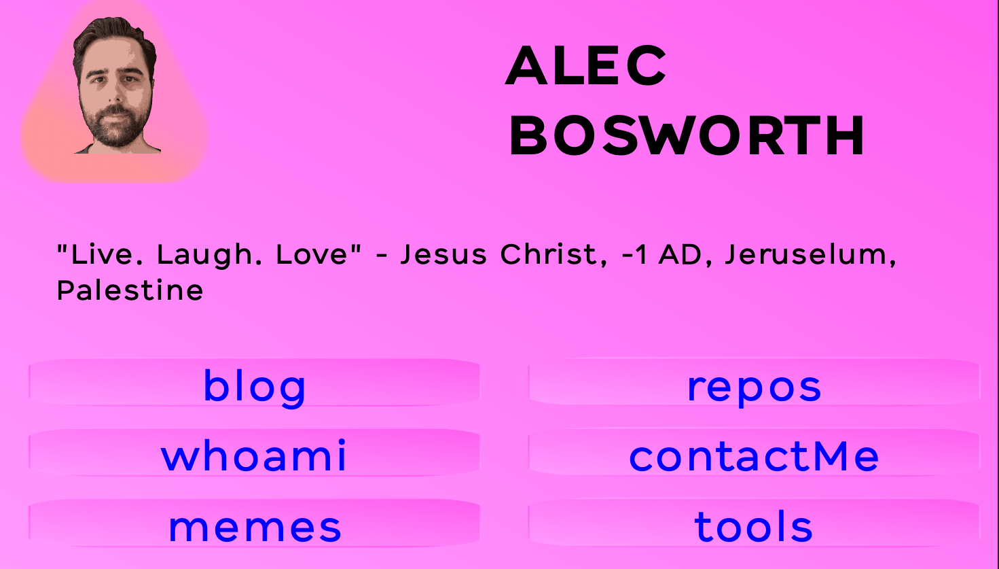
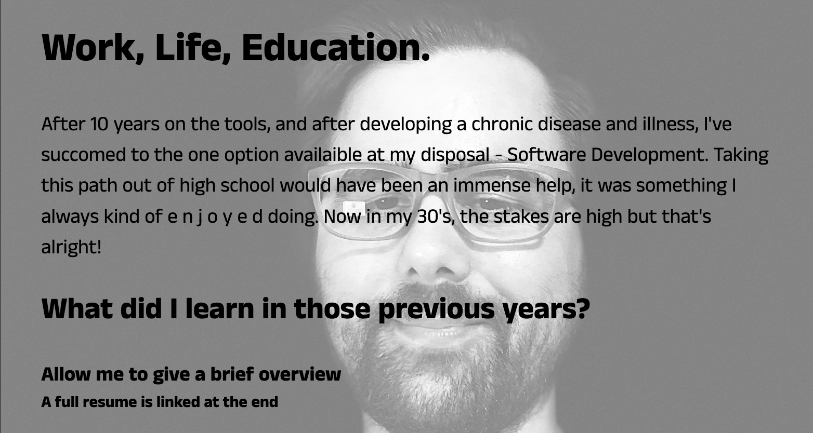
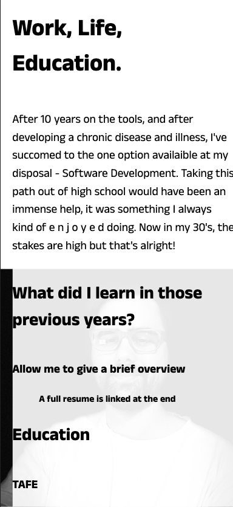
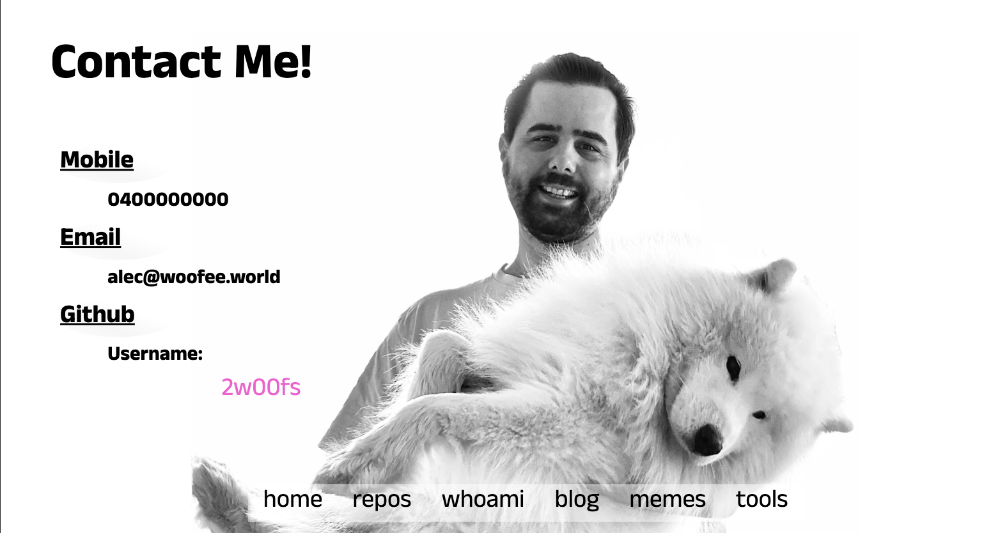
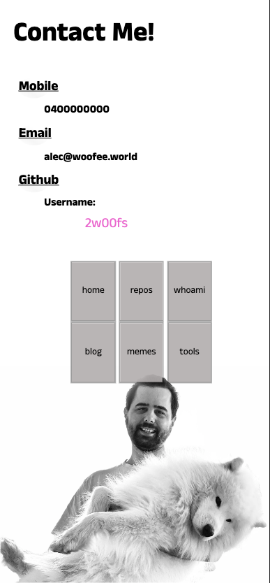
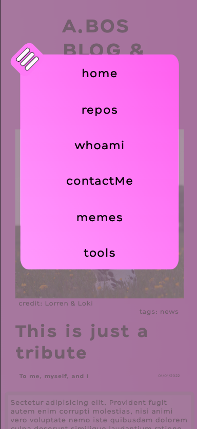
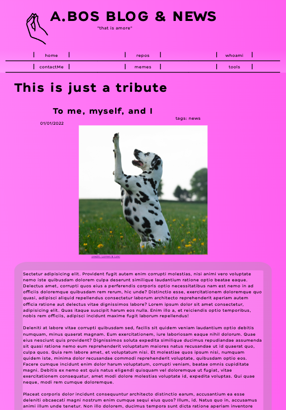
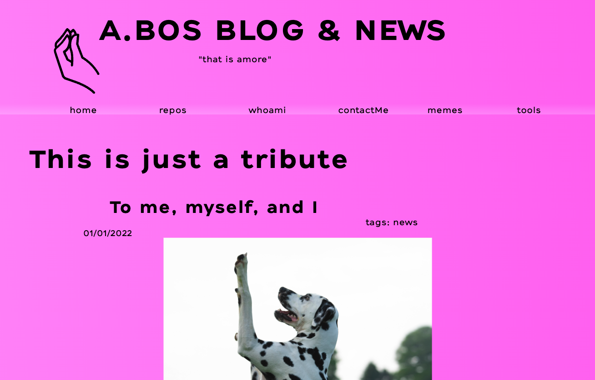

## Purpose

The purpose of my portfolio website is to highlight who I am and what I’m passionate about, while displaying my coding skills. I’m not a serious person, so the website is designed to highlight my personality. 

> The overriding design goal for Markdown's
> formatting syntax is to make it as readable
> as possible. The idea is that a
> Markdown-formatted document should be
> publishable as-is, as plain text, without
> looking like it's been marked up with tags
> or formatting instructions.

The website is designed in a responsive and audience centric way, and features:
- A responsive design that will display all components at desktop, mobile, and tablet viewport widths
- Alt text is featured on all images for screen readers to enhance accessibility across the site
- Design elements have been picked with accessibility for all users in mind, including easy to read text, colourful combinations with high contrast, easy to navigate links in a large sized fonts
- The imagery and colours picked are designed to make it easy for visitors to navigate the site, to highlight what is clickable and important content 
- Every page features a navigation bar, so visitors can easily navigate their way through the site and explore the structure of the site
## Sitemap
```
index
    | - blog
    | - whoami
    | - contact
```
## Screenshots
##### Index - Phone View

##### Index Banner Desktop

##### Index Desktop View

##### whoami Desktop View

##### whoami Phone View

##### Contact Me Desktop View

##### Contact Me Phone View

##### Blog Phone View

##### Blog Menu Phone View

##### Blog Tablet View

##### Blog Desktop View



## Target Audience

Peers within my network, recruiters 

## Tech Stack

- HTML
- CSS
- JavaScript

## Published Page
[2w00fz.github.io](https://2w00fz.github.io)

## Repository
[Repository](https://github.com/2w00fs/2w00fs.github.io)

## Link To Presentation
[YouTube Presentation](https://github.com/2w00fs/2w00fs.github.io)https://youtu.be/JMSnrW1322Q)
